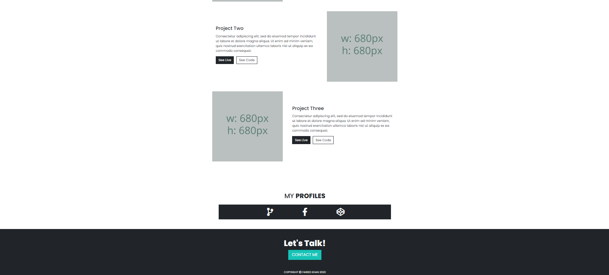

## Responsive Portfolio Website

A simple and clean <strong>Portfolio website for developers</strong>, where they can share their projects along with a link of live preview of their web project

 

<h3>Simple Setup</h3>

Images folder contain screen-shot of Github projects

<strong>width and heights are mentioned as :</strong> 680px x 680px

Live link and source code can be change with your own provided link

